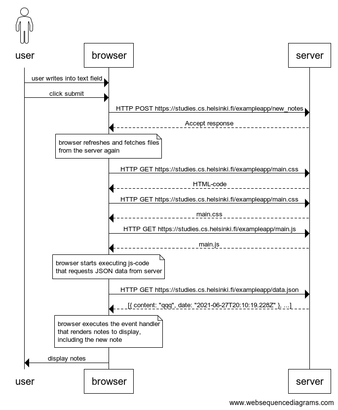
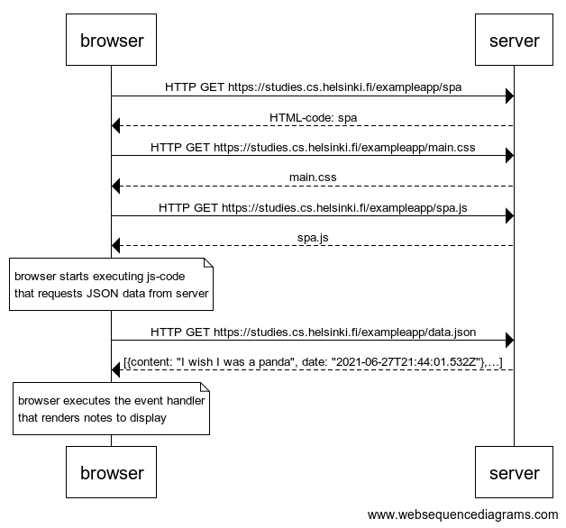

# Solution for Exercises 0.4.-0.6.

The diagrams were made using [websequencediagrams](https://www.websequencediagrams.com/) service.

## 0.4: new note



```
actor user
user->browser: user writes into text field
user->browser: click submit

browser->server: HTTP POST https://studies.cs.helsinki.fi/exampleapp/new_notes
server-->browser: Accept response

note over browser:
browser refreshes and fetches files
from the server again
end note


browser->server: HTTP GET https://studies.cs.helsinki.fi/exampleapp/notes
server-->browser: HTML-code
browser->server: HTTP GET https://studies.cs.helsinki.fi/exampleapp/main.css
server-->browser: main.css
browser->server: HTTP GET https://studies.cs.helsinki.fi/exampleapp/main.js
server-->browser: main.js

note over browser:
browser starts executing js-code
that requests JSON data from server 
end note


browser->server: HTTP GET https://studies.cs.helsinki.fi/exampleapp/data.json
server-->browser: [{ content: "qqq", date: "2021-06-27T20:10:19.228Z" }, ...]

note over browser:
browser executes the event handler
that renders notes to display,
including the new note
end note

browser->user: display notes
```

## 0.5: Single page app



```
browser->server: HTTP GET https://studies.cs.helsinki.fi/exampleapp/spa
server-->browser: HTML-code: spa
browser->server: HTTP GET https://studies.cs.helsinki.fi/exampleapp/main.css
server-->browser: main.css
browser->server: HTTP GET https://studies.cs.helsinki.fi/exampleapp/spa.js
server-->browser: spa.js

note over browser:
browser starts executing js-code
that requests JSON data from server 
end note


browser->server: HTTP GET https://studies.cs.helsinki.fi/exampleapp/data.json
server-->browser: [{content: "I wish I was a panda", date: "2021-06-27T21:44:01.532Z"},…]

note over browser:
browser executes the event handler
that renders notes to display
end note
```